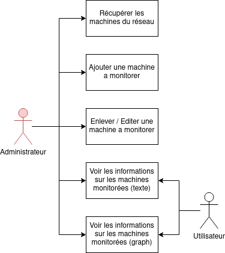

# Projet SNMP

Le projet consiste à développer un outil permettant de monitorer des équipements en utilisant le protocole SNMP.
Les objectifs sont les suivants :

- Surveiller en ligne l'ensemble du matériel constituant le parc. Elle peut avoir une représentation graphique ou/et textuelle.
- Sauvegarder l'ensemble des données issues des équipements.
- Gérer les erreurs possibles en les signalant à l'utilisateur et dans un système de log.

## Organisation de l'application

### Module de configuration

L'application doit être configurable, c'est à dire qu'il doit être possible d'ajouter du nouveau matériel a configurer, ou supprimer un équipement. Les informations importantes sont le matériel en lui même et le type d'information a monitorer.
Il faut donc développer un module qui permet de gérer cette configuration de la façon la plus simple possible. 

### Module de surveillance

Ce module doit pouvoir contacter les équipements décrits dans la configuration afin de les surveiller en les interrogeant de manière périodique en utilisant SNMP. Les informations alors obtenues seront alors utilisées pour de l'affichage graphique ou/et textuel.

### Module de "Log"

Pour une application de surveillance, il est très important de consigner chaque évènement (information, erreur) dans une base de données. Cela permet en particulier de pouvoir retracer l'historique d'un équipement mais aussi de rajouter des modules de détection de panne, de surveillance de vieillissement.

## Organisation du travail

Chaque module peut être développé indépendamment. Ils feront chacun l'objet d'une étude permettant de définir les fonctionnalités essentielles (Use Cases). Un schéma de classes décrivant les principales entités du module et leurs relations avec les classes internes ou extérieures au module constitueront le point de départ de chacune des implémentations.

## Implémentation

### Choix techniques

#### Langage

Le langage principal utilisé pour développer cette application est le Python. C'est un langage maîtrisé par les membres du binôme. C'est aussi un langage pertinent pour faire une application de ce genre : il est possible de créer une interface, de lire des fichiers et de communiquer avec une base de donnée.

Le module de surveillance sera développé en bash, car la commande `snmptable` permet une gestion des données plus simple. Lorsque l'on veut récupérer la liste des interfaces par exemple, cette commande permet d'obtenir toutes les informations sous forme de csv ce qui rend le transfert d'informations plus simple. Nous n'avons pas trouvé d'alternative satisfaisante a cette commande en Python.

#### Architecture

L'application sera découpée en plusieurs modules différents :

- Module de configuration
- Module de surveillance
- Module de traitement des données
- Module de log
- Module de connexion a la base de donnée
- Module "interface web"

Les modules seront développés pour pouvoir fonctionner de manière indépendante. Ils communiqueront via API REST. Ce choix de fonctionnement a été choisi afin de permettre à l'administrateur de l'application de mettre les modules sur différents serveurs, si il le souhaite. Ce fonctionnement permet aussi de limiter la charge de travail sur un seul module en répartissant les taches entre différents modules. 

### Organisation du travail

Nous avons décider d'utiliser Trello pour la gestion de projet. Cet outil correspond bien a notre projet, chaque module correspondant a une tache, chaque taches ayant des "objectifs" a remplir pour être complétée.

Le code est stocké sur un dépot github privé. Il est constitué de plusieurs dossiers : un dossier par module développé.
L'utilisation de github permet de travailler sur un même projet facilement, tout en ayant un historique des versions.
Les fonctions et variables seront nommées en utilisant un '`_`' pour séparer les mots.

Pour la communication interne au binôme, les applications Teams et Discord sont utilisées.

L'application est testée sur un environnement physique présent

### Avancement

#### Module de configuration

Cas d'utilisation du module de configuration :

**Organisation du module :**
	Classe Conf_Reader qui va s'occuper de la lecture du fichier de configuration.
	Cette classe sera utilisé dans la fonction principale.
	Les différentes méthodes de Conf_Reader seront réparties sur différents endpoint en utilisant des méthodes différentes (POST, GET, PUT etc...)

Le module de configuration est développé en Python.
Il permet de lire un fichier XML et de le modifier (ajouter un élément, supprimer un élément, éditer un élément).
L'utilisation d'un fichier XML permet a un administrateur d'aller éditer le fichier directement si il le souhaite.

Ce module est accessible via une API REST. La base de cette API se fait grâce au framework web `Flask` et son module `Flask RESTful`.
Il propose 2 endpoint :

- `/api/devices` pour récupérer la liste des équipements et créer un nouvel équipement.
- `/api/devices/<device_ip>` pour modifier ou supprimer un équipement, un équipement étant reconnu par son adresse IP.

La difficulté principale rencontrée lors du développement de ce module fut le traitement du fichier XML. Il fallait d'abord réfléchir à une organisation du fichier pertinente, puis réussir a modifier / supprimer une valeur précise. retrouver un élément dans un fichier XML a pris plus de temps que prévu. 

Ce module est terminé, il propose toutes les fonctionnalités prévues initialement.

#### Module de surveillance

Le module de configuration est développé en Bash. Il comprend un script qui récupère via un ´curl´ les équipements à monitorer ainsi que leurs communautées et toutes informations pouvant être utile. Ensuite via des ´snmptable´, nous récupérons les données en les écrivant dans des fichiers "csv" le temps de les traiter. 

Ce module demande l'installation de snmp et des mibs via les dépots apt-get natif sous linux debian.

A ce jour le collecteur est fini. Dans une optique d'amélioration, nous voudrions envoyer de manière dynamiques les informations d'un serveur à un autre afin de faire la répartition de charge.

L'idée serait d'envoyer les informations sous forme de ´PUT´ sous la forme :
"@IP de l'équipement"_"Element monitoré"_"valeur1"_"valeur2"_.....

#### Module de traitement des données

Le développement de ce module débutera à la fin du développement du module de surveillance.
Son but principal étant de traiter les données du collecteur pour ensuite les stocker en base de donnée.

Il est codé en python ou il lis les fichiers CSV, fait du nettoyage pour les fichiers qui pourraient avoir des problèmes.
Ensuite nous envoyons les données au serveur de base de données.

Ce module a besoin de l'installation de "requests".

#### Module de log

Il a été décidé de stocker les différents logs dans une base de donnée.

#### Module de connexion a la base de donnée

Ce module sera l'intermédiaire entre les modules ayant besoin d'accéder à la base de donnée et la base de donnée en elle même.

Cela permet de ne pas avoir les informations de connection à la base de donnée dans différents modules. Ces informations sont stockées directement dans le module de connection a la base de donnée.

Pour le moment, ce module ne doit que servir d'intermédiaire, mais il faut développer ce module en ayant en tête la possibilité d'un système d'authentification. Ce système ne sera peut être pas développé en raison de contraintes de temps.

#### Module de "interface web"

Cette interface sera très simple :

- un tableau récapitulatif des résultats du collecteur (avec possibilité de trier par nom/ip)
- une page spéciale montrant les logs.
- une page permettant de visionner des statistiques sur un appareil (si suffisemment de temps)

## Conclusion

Pour le moment, le module de configuration est finalisé, une infrastructure de test pour l'application est mise en place et le module de surveillance est en cours de développement.

Le projet avance comme prévu, un petit peu de retard a été pris pour mettre en place une infrastructure de test fonctionnelle.
Il est prévu de mettre en place la base de donnée ainsi que le module de connection a la base de donnée dans les prochaines semaines. En parallèle, le module de surveillance sera en développement, si il est finalisé, le développement du module de traitement débutera.
Le système de log sera développé a la fin, car il faut une base de donnée fonctionnelle pour son fonctionnement.

Pour ce qui est de l'interface web, ce sera la partie finale du projet.
